# FIAP - Faculdade de Informática e Administração Paulista

 

# Curso Inteligencia Articicial - Fase 3 - Cap 1 - Etapas de uma Máquina Agrícola

## 👨‍🎓 Integrantes: 
##Integrantes:
- Matheus de S. Santos Rm566901
- Ricardo José Amorin Rm567312
- Klaus Lohany Barbosa de Oliveira
- Victor Oliveira Fedeli Tate Rm566823
- Paulo Roberto Silva Amaral Ribeiro Junior Rm568413

## 👩‍🏫 Professores:
### Tutor(a) 
- Ana Cristina 
### Coordenador(a)
- Andre Godoi

## 📜 Descrição

Esse projeto tem como objetivo a importação de dados no SGBD  SQL Developer da Oracle, demonstrando a consulta e manipulação dos dados simulados de sensores agriculas.
Foi feito a importação de dados de um arquivo .csv e após isso consultado pelo programa da Oracle e manipulado por um codigo python para uma consulta apartir de um periodo pré estabelecido e algumas analises graficas.
O codigo python tem por função capturar todos os dados do periodo selecionado e atraves de graficos associar a irrigação ao Ph do solo e a umidade.

## 📁 Estrutura de pastas
## Passo a Passo da importação do arquivo .csv para o SQL Oracle
## 1° Passo

<a href= "https://www.fiap.com.br/">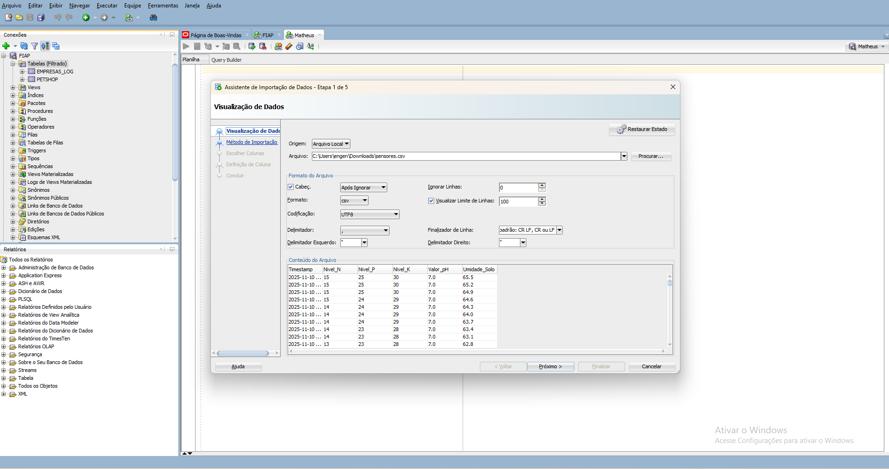</a>

## 2° Passo 

<a href= "https://www.fiap.com.br/">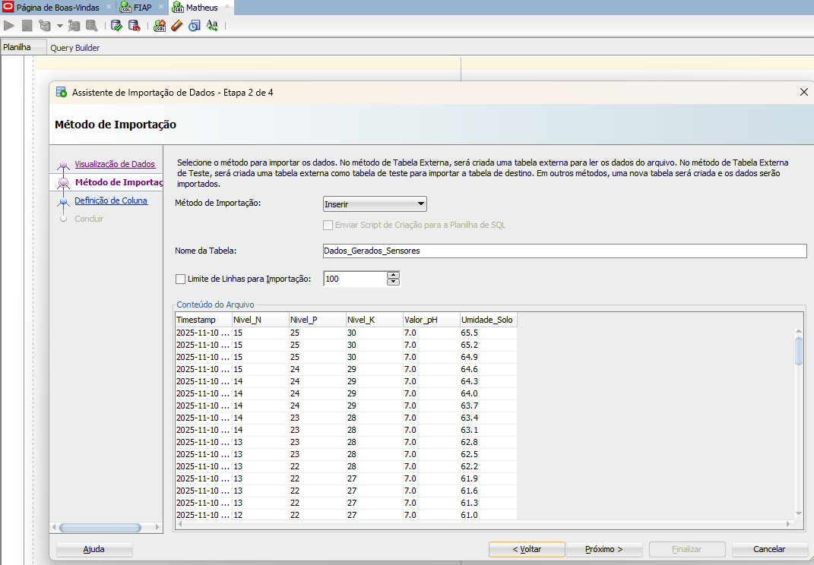</a>

 
 ## 3° Passo

<a href= "https://www.fiap.com.br/">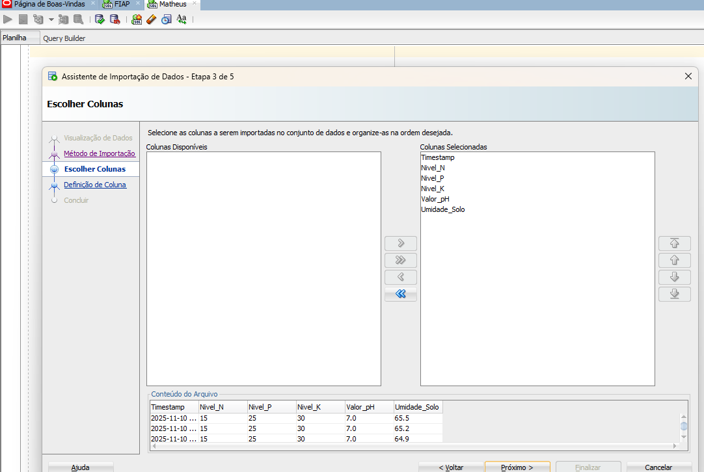</a>

## 4° Passo

<a href= "https://www.fiap.com.br/">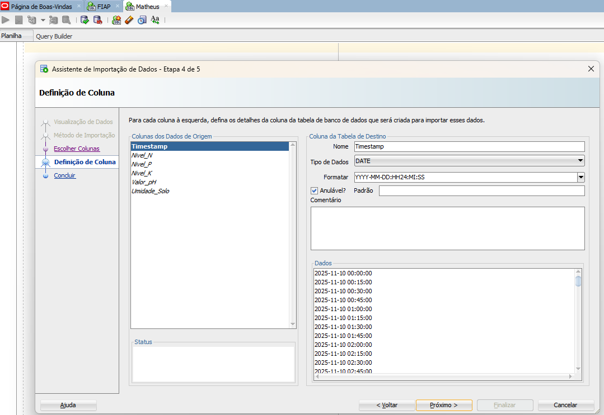</a>

## 5° Passo

<a href= "https://www.fiap.com.br/">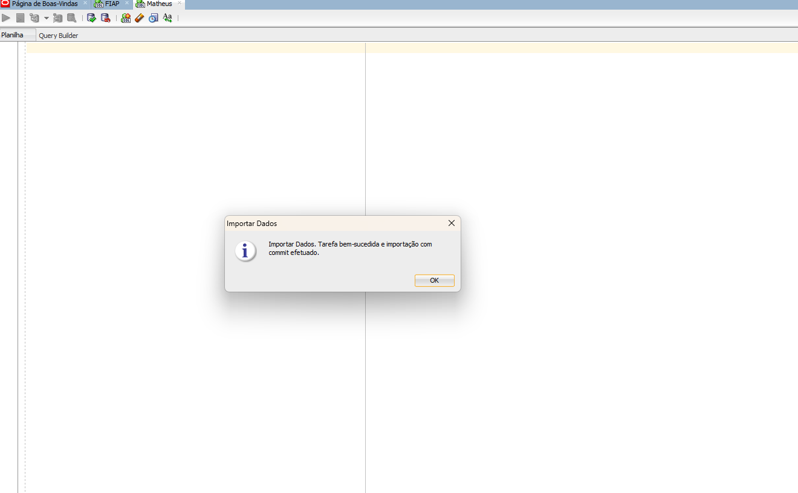</a>

## Comando para exibição dos dados no SGBD

## Confirmação dos tipos de dados.

### 🔧 Codigo Python Funcionando

## Menu

<a href= "https://www.fiap.com.br/">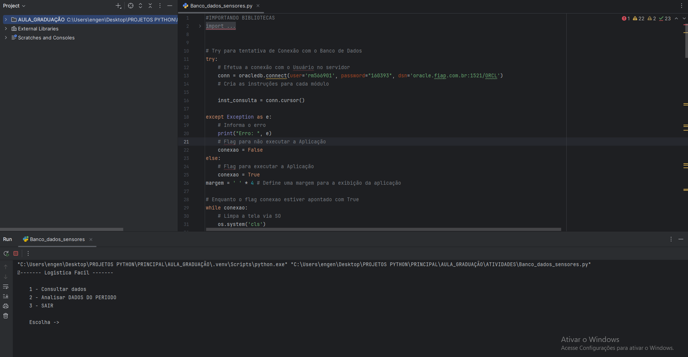</a>

## Opção escolhida 1 : Preenchendo o periodo de consulta

<a href= "https://www.fiap.com.br/">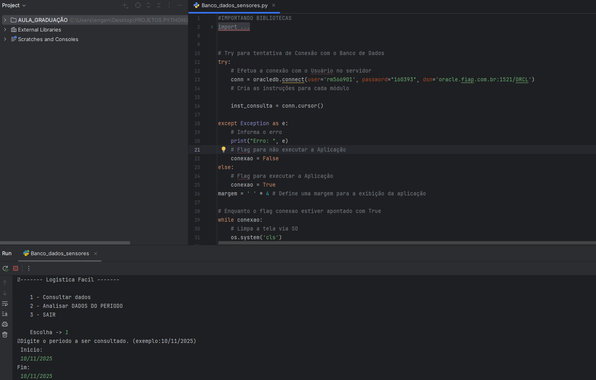</a>

## Resultado da consulta : todos os dados do periodo

<a href= "https://www.fiap.com.br/">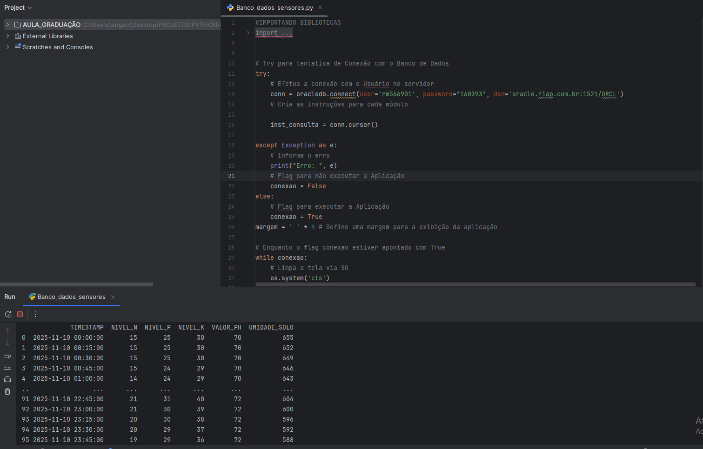</a>

## Opção escolhida 2 : Preenchendo o periodo de consulta e horarios de irrigação

<a href= "https://www.fiap.com.br/">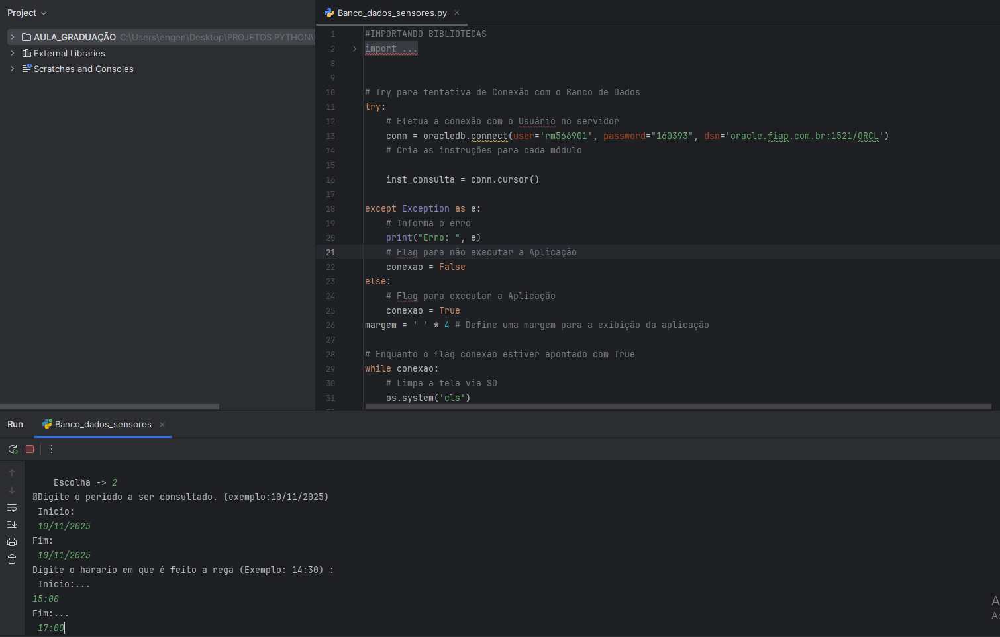</a>

## Resultados das medias de cada elemento no periodo selecionado e produção de graficos.

<a href= "https://www.fiap.com.br/">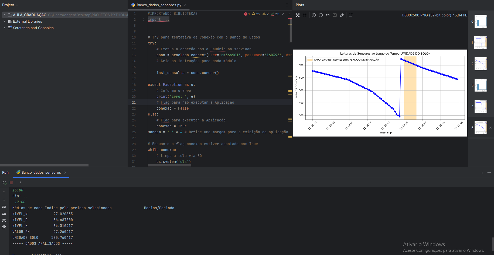</a>

## Grafico 2

## Grafico 3

<a href= "https://www.fiap.com.br/">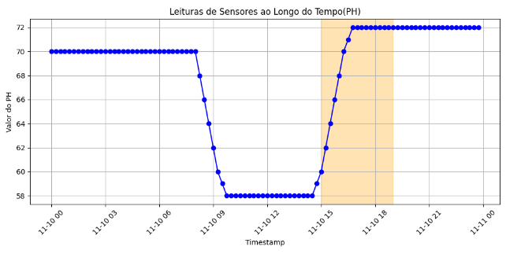</a>

## Video do Funcionamento 
- https://youtu.be/hAtqbNv9iOg

## 🗃 Histórico de lançamentos

* 1.0 - 12./11./2025

    *

